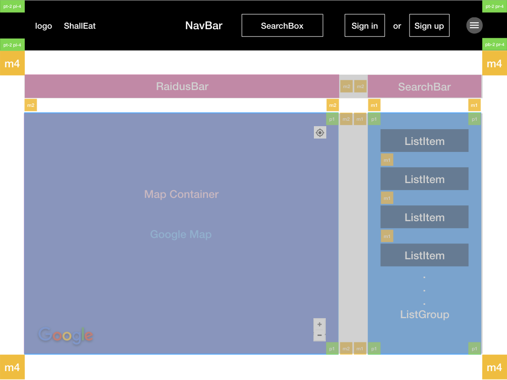
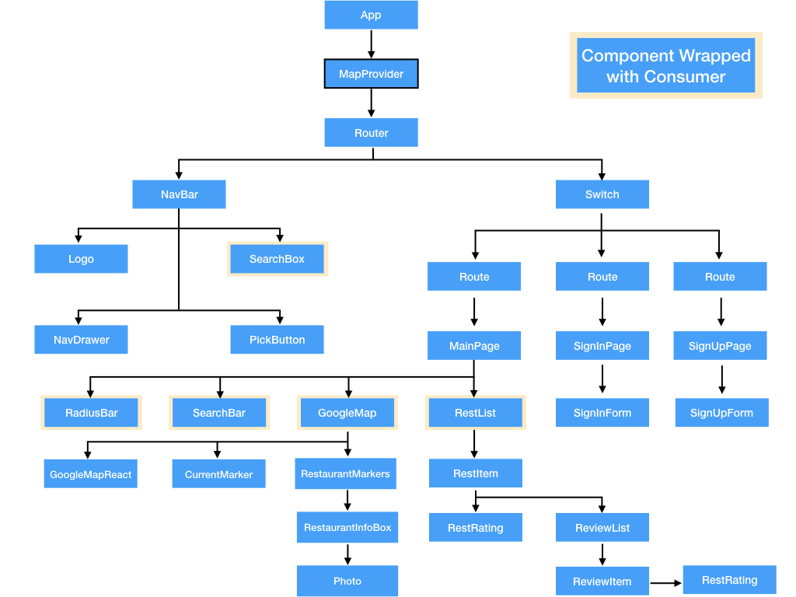

# Shall Eat?

React web application that picks restaurants for you! **Deployed on https://www.shalleat.com/.**
Each restaurants business hour will be shown as remaining time until closing or opening. Also, this remaining time keeps updating every second. Thus, if somebody asks you "when will Sohyang Korean restaurant be opening?, you can say something like "Oh, the restaurant will be opening in 1hours 24munitues 25 seconds" or "the restaurant will be closing in 2hours 18munitues 38seconds" **without having to check current time and calculate the difference between current time and closing or opening hour.** Furthermore, you can actually fetch up to 60 places, but Google restricts only 20 restaurants per request. In terms of functionality, <a href="https://github.com/sunny-heo/ShallEat-API"> ShallEat Web API server</a> can fetch 60 restaurants by sending requests to google recursively. However, this will quickly exceed daily requrest limit. Thus, I restrict that only 20 restaurnts render on the map. If you set up the backend server on your local machine with your place api key, you can get maximum 60 restuarants:) I hope you enjoy with ShallEat. Thank you 😁

## Component Layout



## Component Hierarchy



## Demo

> 👇 Pick for me button demo. (green = {openNow: true), dark = {openNow: false})

> 

> 👇 Main search box demo.

> 

> 👇 Another main search box demo. (This search box accepts other mesures as well)

> 

> 👇 Restaurant info box demo.

> 

## Getting Started

This application needs backend server that provides REST API to authenticate users and recieve restaurant data. In Prerequisites, there is an instruction to clone that server as well.

### Prerequisites

1.  You need to install npm or yarn.
2.  You need to get Google Map API(for frontend) ~~and Google Place API(for backend) here is link(https://cloud.google.com/maps-platform/)~~
3.  Assign google map api key to `googleMapAPI`. You can find this variable by typing 👇 commands in terminal after you clone this repository.

```
$ mv src/requests/example_configuration.js src/requests/configuration.js
$ open src/requests/configuration.js
```

4.  After you store map api key, then follow next instruction.

### Installing

~~This command to set up REST API server. (100% JavaScript)~~

> ```
> $ git clone git@github.com:sunny-heo/ShallEat-API.git
> ```

\*\* Since the backend server is deployed, you don't have to set up this web api server.

~~The rest of setup instruction for the server is available here 👇:  
 https://github.com/sunny-heo/ShallEat-API~~

If you do want to set up the backend server on your local machine, you need to update `fetchConfig.js` in requests directory. This command will open that file.

```
$ open ./src/requests/fetchConfig.js
```

After the file opened, you need to comment out this line (`export const DOMAIN_URL = "https://shalleatapi.herokuapp.com";`) and uncomment this line (`export const DOMAIN_URL = "https://localhost:8080";`)

This command to clone ShallEat-React application (98% JavaScript)

```
$ git clone git@github.com:sunny-heo/ShallEat-React.git
```

Install packages with npm or yarn

```
$ npm install
$ yarn install
```
Before running server, you need to compile Sass files to css files with these command

```
$ npm run sass
$ yarn run sass
```

After the compilation, exit the process by pressing

```
control + c
```

Run server

```
$ npm start
$ yarn start
```

\*\* ~~Since this application is running by fetching data from the server, if you did't set up and run ShallEat-API server yet, this application will not work as expected.~~

## Deployment

**https://www.shalleat.com/**

## Built With

- react
- recompose
- google-map-react
- daemonite-materi
- react-animated-css
- react-star-ratings
- reactstrap
- moment
- animejs
- react-tippy

## Usage

There are two seach box, one at the navbar(main search box), another at the right above the review list.

1.  Main search box

- Type "`Keyword` in `radius`" eg. "`Korean restaurants` in `10km`"
- This serach box support following units:
  - mile(miles)
  - cm
  - m
  - km
  - inch(inches)
  - yard
  - foot

2.  Second search box

- Type "`restaurant name`" eg. "`A&W`"
- This will only display matching restaurants in reveiw list and markers on google map
